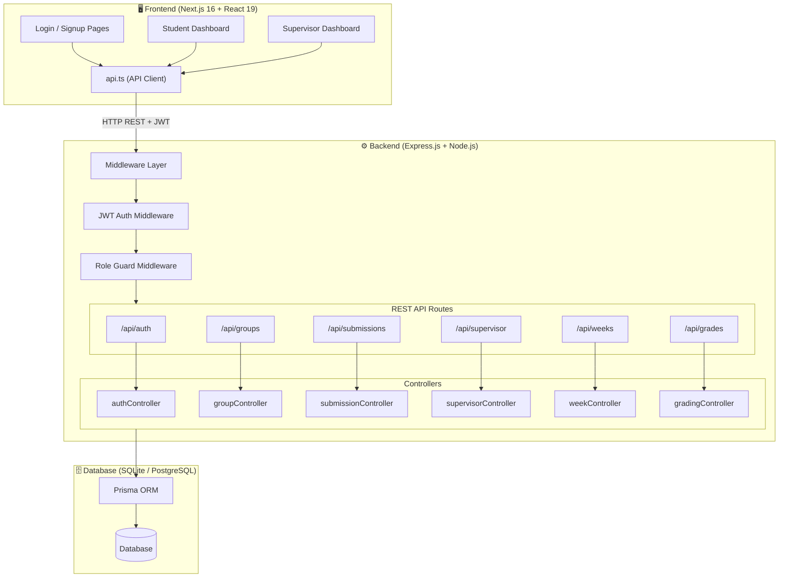
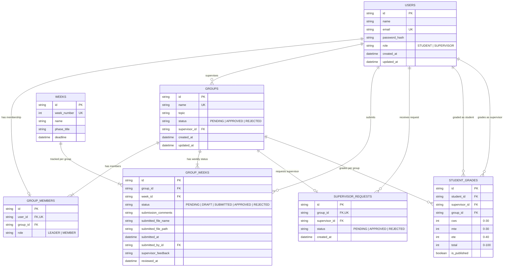
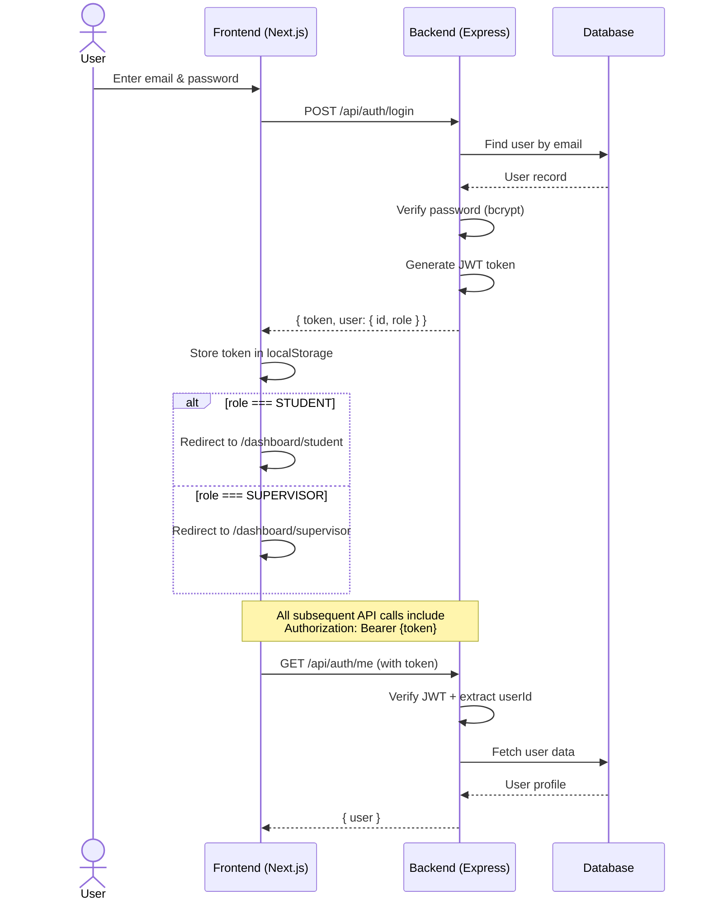
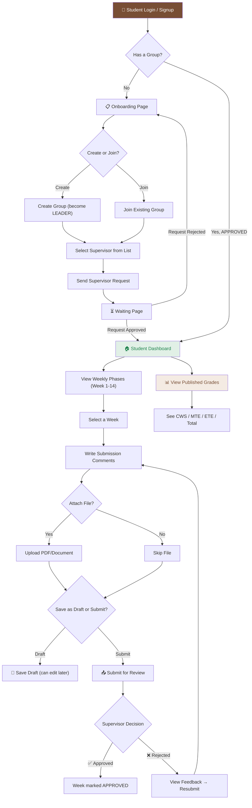
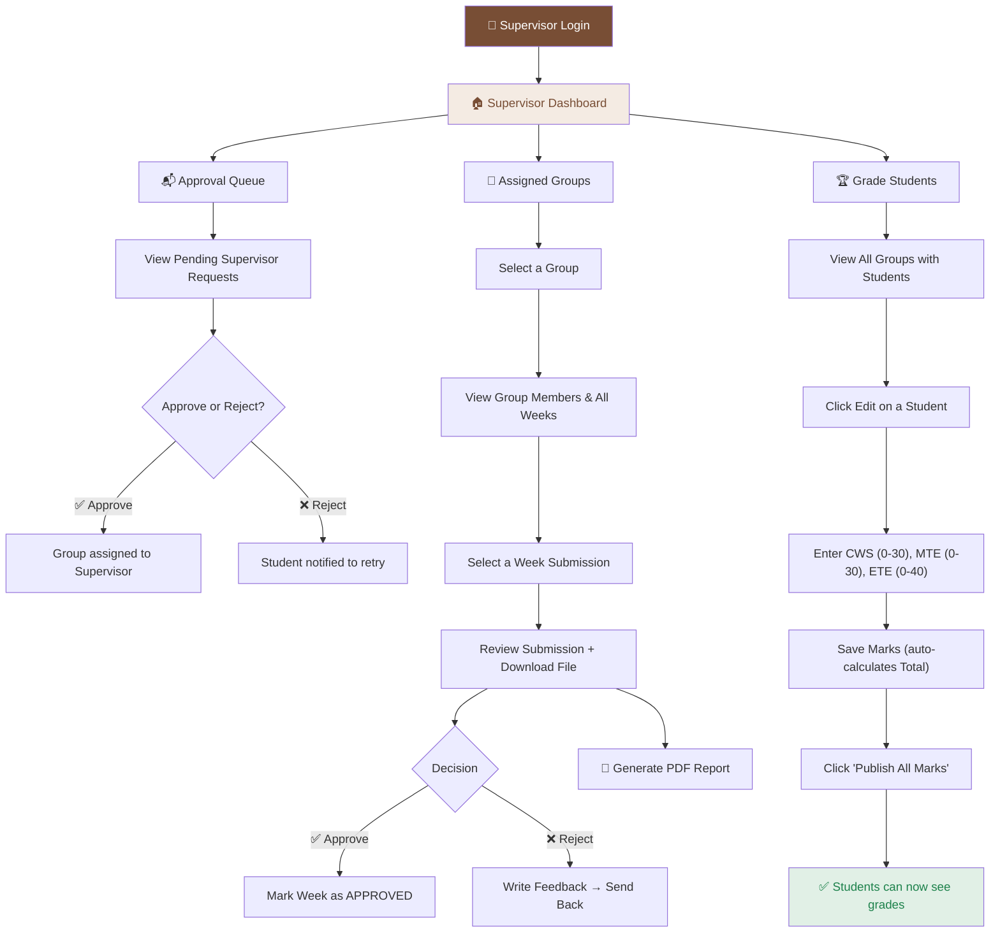
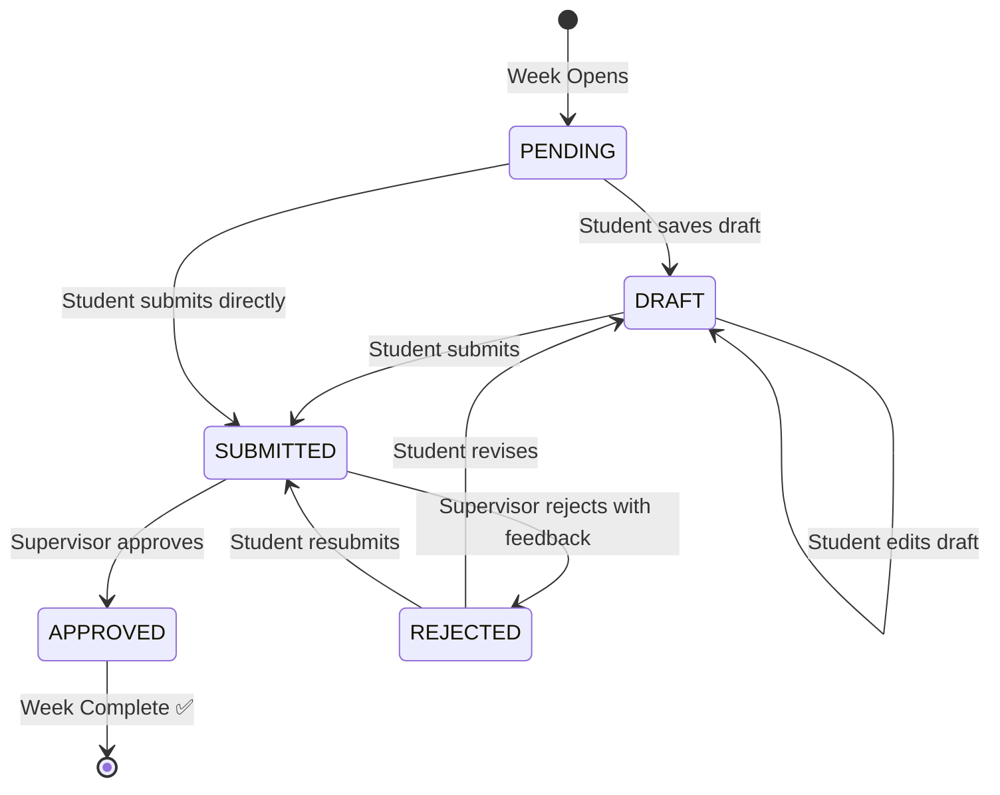
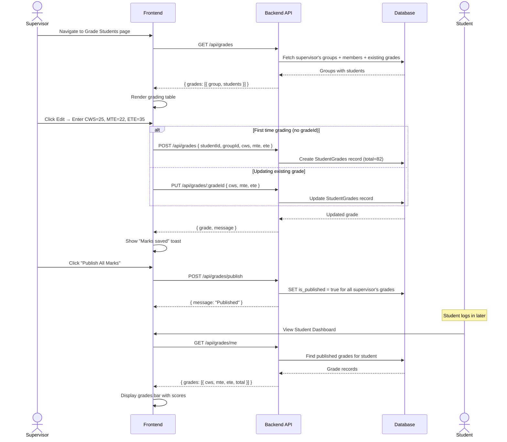

# PBL Portal — Project Documentation & Diagrams

## 1. Project Overview

**PBL Portal** is a full-stack web application for managing **Project-Based Learning** in an academic institution. It connects **Students** and **Supervisors** through a structured weekly submission and evaluation workflow.

### Key Features
- Role-based authentication (Student / Supervisor)
- Group formation and supervisor assignment
- Weekly project submission with file uploads
- Supervisor review (Approve / Reject with feedback)
- PDF report generation
- Student grading system (CWS / MTE / ETE)
- Grade publishing

---

## 2. System Architecture



---

## 3. Entity Relationship (ER) Diagram



---

## 4. Authentication Flow



---

## 5. Student Complete Workflow



---

## 6. Supervisor Complete Workflow



---

## 7. Weekly Submission & Review Lifecycle



---

## 8. Grading Flow



---

## 9. Tech Stack Summary

```mermaid
graph LR
    subgraph Frontend["Frontend"]
        NJ["Next.js 16"]
        R19["React 19"]
        TW["Tailwind CSS 4"]
        LR["Lucide React Icons"]
    end

    subgraph Backend["Backend"]
        EX["Express.js 5"]
        PR["Prisma ORM"]
        JWT["JWT Auth"]
        BC["bcrypt"]
        PK["PDFKit"]
        ZD["Zod Validation"]
    end

    subgraph Infrastructure["Infrastructure"]
        SL["SQLite (Dev)"]
        PG["PostgreSQL (Prod)"]
        ND["Node.js"]
    end

    Frontend -->|"REST API"| Backend
    Backend -->|"Prisma Client"| Infrastructure
```



---

## 10. API Route Map

| Module | Method | Endpoint | Role | Description |
|--------|--------|----------|------|-------------|
| **Auth** | POST | `/api/auth/signup/student` | Public | Student registration |
| | POST | `/api/auth/signup/teacher` | Public | Supervisor registration (invite code) |
| | POST | `/api/auth/login` | Public | Login (returns JWT) |
| | GET | `/api/auth/me` | Any | Get current user profile |
| **Groups** | POST | `/api/groups` | Student | Create a new group |
| | POST | `/api/groups/join` | Student | Join existing group |
| | GET | `/api/groups/me` | Student | Get my group info |
| | GET | `/api/groups/supervisors` | Student | List available supervisors |
| | POST | `/api/groups/request-supervisor` | Student | Request supervisor assignment |
| | GET | `/api/groups/my-group/weeks` | Student | Get weekly progress |
| **Submissions** | POST | `/api/submissions/:weekId` | Student | Submit/save draft for a week |
| | GET | `/api/submissions/:weekId/file` | Student | Download own submission file |
| **Supervisor** | GET | `/api/supervisor/groups` | Supervisor | List assigned groups |
| | GET | `/api/supervisor/groups/:id` | Supervisor | Group detail with members |
| | GET | `/api/supervisor/groups/:gid/weeks/:wid` | Supervisor | Week submission detail |
| | PUT | `/api/supervisor/groups/:gid/weeks/:wid/approve` | Supervisor | Approve submission |
| | PUT | `/api/supervisor/groups/:gid/weeks/:wid/reject` | Supervisor | Reject with feedback |
| | GET | `/api/supervisor/groups/:gid/weeks/:wid/file` | Supervisor | Download student's file |
| | POST | `/api/supervisor/groups/:gid/weeks/:wid/report` | Supervisor | Generate PDF report |
| | GET | `/api/supervisor/requests` | Supervisor | View pending requests |
| | PUT | `/api/supervisor/requests/:id/approve` | Supervisor | Approve group request |
| | PUT | `/api/supervisor/requests/:id/reject` | Supervisor | Reject group request |
| **Grades** | GET | `/api/grades` | Supervisor | Get all students' grades |
| | POST | `/api/grades` | Supervisor | Create grade for student |
| | PUT | `/api/grades/:gradeId` | Supervisor | Update marks |
| | POST | `/api/grades/publish` | Supervisor | Publish all marks |
| | GET | `/api/grades/me` | Student | View own published grades |

---

## 11. Project Directory Structure

```
pbl_v1/
├── app/                          # Next.js Frontend (App Router)
│   ├── page.tsx                  # Login page
│   ├── layout.tsx                # Root layout
│   ├── globals.css               # Global styles + design tokens
│   ├── student-signup/           # Student registration
│   ├── supervisor-signup/        # Supervisor registration
│   ├── lib/
│   │   └── api.ts                # All API client functions
│   ├── components/
│   │   ├── ProtectedRoute.tsx    # Auth guard component
│   │   ├── ui/                   # Reusable UI components
│   │   └── dashboard/            # Shared dashboard components
│   └── dashboard/
│       ├── student/
│       │   ├── page.tsx          # Student main dashboard
│       │   ├── onboarding/       # Group creation/joining
│       │   └── waiting/          # Awaiting supervisor approval
│       └── supervisor/
│           ├── page.tsx          # Supervisor main dashboard
│           ├── components/       # Sidebar, Navbar
│           ├── groups/           # View assigned groups
│           ├── requests/         # Approve/reject requests
│           └── grades/           # Grade students
│
├── server/                       # Express.js Backend
│   ├── index.js                  # App entry point
│   ├── prisma.js                 # Prisma client singleton
│   ├── middleware/
│   │   └── authMiddleware.js     # JWT verify + role guard
│   ├── controllers/
│   │   ├── authController.js     # Login, signup, getMe
│   │   ├── groupController.js    # Group CRUD + supervisor request
│   │   ├── submissionController.js # File upload + submissions
│   │   ├── supervisorController.js # Review, approve, PDF gen
│   │   ├── weekController.js     # Week status management
│   │   └── gradingController.js  # CWS/MTE/ETE grading
│   ├── routes/                   # Express route definitions
│   ├── prisma/
│   │   └── schema.prisma         # Database schema
│   ├── scripts/
│   │   └── bootstrap-db.js       # SQLite table creation
│   ├── seed.js                   # Seed academic weeks
│   └── seed_supervisor_mock.js   # Seed demo supervisors
│
├── package.json                  # Frontend dependencies
└── README.md                     # Setup instructions
```

---

## 12. Security Features

| Feature | Implementation |
|---------|---------------|
| **Password Hashing** | bcrypt with salt rounds |
| **Authentication** | JWT tokens with expiry |
| **Route Protection** | `verifyToken` middleware on all protected routes |
| **Role-Based Access** | `requireRole()` middleware (STUDENT / SUPERVISOR) |
| **Frontend Guards** | `ProtectedRoute` component checks role before rendering |
| **Rate Limiting** | `express-rate-limit` on all endpoints |
| **Security Headers** | `helmet` middleware |
| **CORS** | Configured for cross-origin requests |
| **Input Validation** | Zod schemas + manual validation for marks |
